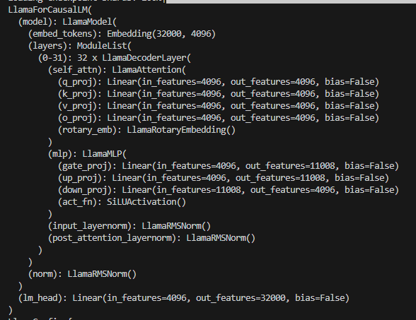
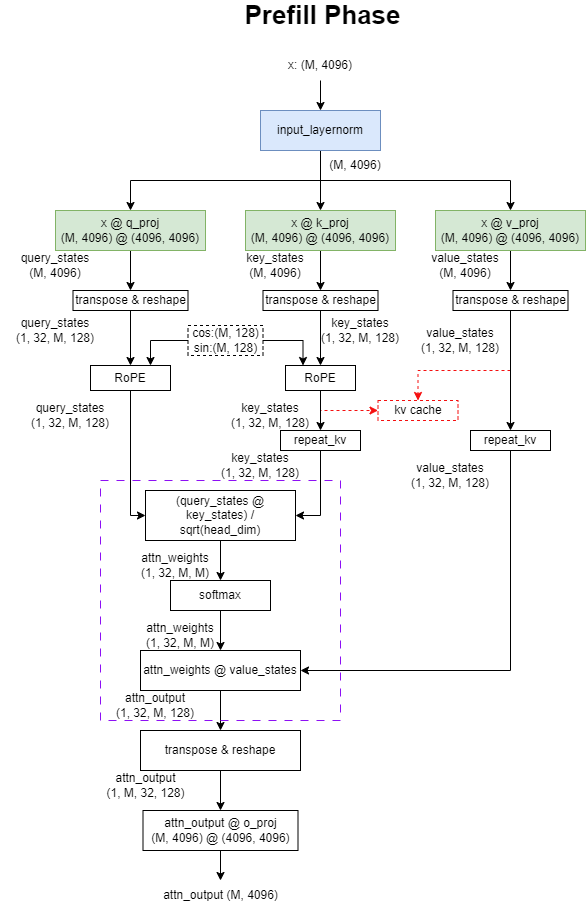

# Llama 2

Llama 2 model was proposed by Meta, [Llama 2: Open Foundation and Fine-Tuned Chat Models](https://ai.meta.com/research/publications/llama-2-open-foundation-and-fine-tuned-chat-models/).

# Features
1. w4a16: AWQ on CPU, AIE **(AWQ for Llama2 from MIT-Han-lab)**
2. w8a8, w8a16: SmoothQuant + PTDQ **(Smoothquant for Llama2 has been developed in-house as this is not available in open source repo. So, please use caution - this needs to go through legal for distribution)**
3. WIP - Flash Attention v2 for long prompts - reduces prefill time and memory consumption
4. Static memory allocation for token phase speed up
5. Matmul grouping for Llama2Attn
6. Model save and load from checkpoints
7. Profiling instrumentation to measure prefill/token times during mission mode


# Perplexity on STX B0  (7/13/2024)

***Perplexity ios measured on wikitext2-raw dataset***

```python run_awq.py --model_name llama-2-7b --algorithm awqplus --task perplexity --fast_attention --fast_mlp --fast_norm```

***nsamples = 4***

| Seqlen | CPU bf16 | CPU (awq) | NPU (awq) old |  NPU (awq+)
|--------|----------|-----------|---------------|------------
| 16     |  58.0150 |  64.6578  |  64.7958      |  61.0127
| 96     |  10.1169 |  10.7178  |  10.7414      |  10.8616
| 192    |   8.4135 |   8.6014  |   8.6241      |   8.6681
| 256    |   7.7810 |   7.9951  |   8.0011      |   8.0280
| 512    |   6.6059 |   6.8477  |   6.8488      |   6.9191
| 768    |   6.1680 |   6.3582  |   6.3591      |  11.9049
| 1024   |   6.1827 |   6.3626  |   6.3658      |   6.4345
| 1536   |   6.4701 |   6.6194  |   6.6201      |   8.8625
| 2048   |   6.3011 |   6.4385  |   6.4402      |   6.5028

# Perplexity scores
Perplexity is measured using negative log likelihood scores.
***Perplexity ios measured on wikitext2-raw dataset***
***Perplexity measurement takes several hours on both CPU and AIE***
***Lower value is better***

On RyzenAI, it takes ~5 hrs to calculate perplexity on entire testset (82 samples) with sequence length of 4096.

The following are perplexity measurements for "llama-2-7b" model.

**MMLU is measured on 30 samples of abstract_algebra**

| **Precision + Config**                          | **Device** | **Perplexity (2 samples)** | **Perplexity (all 82 samples)** | **MMLU**
|-------------------------------------------------|------------|----------------------------|---------------------------------|-----------
BF16                                              | CPU        |  5.976                     | 5.206                           | 33.33
w4abf16 (AWQ, 4-bit, g:128) + FA                  | NPU        |  6.091                     | 5.318                           | 33.33
w4abf16 (AWQ, 4-bit, g:128) + FA + lm_head(g:32)  | NPU        |  6.128                     | 5.353                           | 30.00
w4abf16 (AWQ, 3-bit, g:128) + FA                  | NPU        |  6.790                     | 5.921                           | 36.67
w4abf16 (AWQ, 3-bit, g:128) + FA + lm_head(g:32)  | NPU        |  6.951                     | 6.058                           | 40.00
w8a8  (SmoothQuant + PTDQ) + FA                   | NPU        | 19.745                     | na                              | 26.67
w8a16 (SmoothQuant + PTDQ) + FA                   | NPU        |  6.990                     | na                              | na

New STX B0 MMLU
w4abf16 (AWQ, 4-bit, g:128) + FA + lm_head(g:32)  | NPU        |  --                        | --                              | 30.00

# Support modes on AIE/IPU - 2024.01

| Precision    | PHX      | STX     | HPT
:--------------|----------|---------|--------
  w8a8         |  &check; | &check; | &check;
  w8a8 + FA    |  &check; | &check; | &check;
  w8a16        |          | &check; |
  w8a16 + FA   |          | &check; |
  w4abf16      |  &check; | &check; | &check;
  w4abf16 + FA |  &check; | &check; | &check;

**w8a8 and w8a16** use **SmoothQuant**

**w4abf16** uses **AWQ** PerGrp quantization

# Prepare Llama2 Weights to use with HF

The weights of Llama-2 models can be obtained by requesting permission with Meta. Check this [Huggingface page](https://huggingface.co/docs/transformers/main/model_doc/llama2) on Llama-2 for details.

Once weights are obtained, use Huggingface's converter to convert the weights to be compatible to be loaded with HF interface.

```
# directory structure of llama-2 weights
$ls -ltrh llama-2-wts
total 536K
-rw-r--r-- 1 user user 489K Jul 13 15:27 tokenizer.model
-rw-r--r-- 1 user user   50 Jul 13 15:27 tokenizer_checklist.chk
-rw-r--r-- 1 user user 6.9K Jul 14 17:06 LICENSE
-rw-r--r-- 1 user user 4.7K Jul 14 17:06 USE_POLICY.md
drwxr-sr-x 2 user user 4.0K Aug 31 11:12 llama-2-7b
drwxr-sr-x 2 user user 4.0K Aug 31 11:15 llama-2-13b
drwxr-sr-x 2 user user 4.0K Aug 31 11:17 llama-2-70b
drwxr-sr-x 2 user user 4.0K Aug 31 11:17 llama-2-7b-chat
drwxr-sr-x 2 user user 4.0K Aug 31 11:17 llama-2-13b-chat
drwxr-sr-x 2 user user 4.0K Aug 31 11:17 llama-2-70b-chat

# rename llama-2-7b as 7B

$ ls -ltrh llama-2-wts
total 500K
drwxr-sr-x 2 user user 4.0K Sep 28 12:44 7B
-rw-r--r-- 1 user user   50 Sep 28 12:45 tokenizer_checklist.chk
-rw-r--r-- 1 user user 489K Sep 28 12:45 tokenizer.model

# Run the converter
$ python <condainstall>/envs/ryzenai-transformers/lib/python3.9/site-packages/transformers/models/llama/convert_llama_weights_to_hf.py --input_dir ./llama-2-wts/ --model_size 7B --output_dir ./llama-2-wts-hf/7B

# you want to convert llama-2-7b-chat, rename the llama-2-7b-chat to 7B and rerun the converter again as follows

$ python <condainstall>/envs/ryzenai-transformers/lib/python3.9/site-packages/transformers/models/llama/convert_llama_weights_to_hf.py --input_dir ./llama-2-wts/ --model_size 7B --output_dir ./llama-2-wts-hf/7B_chat

# rename 7B as llama-2-7b and 7B_chat as llama-2-7b-chat and place it in this directory (./llm)
```


## [AWQ, AWQPlus and PerGrp Quantized with w4abf16](./llama2_w4abf16.md)

## [SmoothQuant with w8a8/w8a16](./llama2_w8a8_w8a16.md)


# Model Variants
Llama-2 has several variants: **llama-2-7b", llama-2-7b-chat, llama-2-13b, llama-2-13b-chat, llama-2-30b, llama-2-30b-chat**.

Llama2 can support a max. sequence length of 4096 tokens.

# Model Structure
## llama-2-7b , llama-2-7b-chat
This image shows model structure - both have same structure


The following figures show attention in prefill and token phases
| Prefill    | Decode
:------------|---------
 | 

The following figure shows MLP


# Model Computation complexity analysis

```
python run.py --quant_mode none --task opsprofile --target cpu
...

****************************************
Seqlen: 4  GOPs: 52.871958808
Seqlen: 8  GOPs: 105.76046139200001
Seqlen: 16  GOPs: 211.58789660800002
Seqlen: 32  GOPs: 423.44448723200003
Seqlen: 64  GOPs: 847.964549248
Seqlen: 128  GOPs: 1700.232196352
Seqlen: 256  GOPs: 3417.6775828480004
Seqlen: 512  GOPs: 6904.2087249920005
Seqlen: 1024  GOPs: 14083.832485888
Seqlen: 2000  GOPs: 28532.896046240003
Seqlen: 3000  GOPs: 44375.283032240004
Seqlen: 4000  GOPs: 61268.295954240006
```
